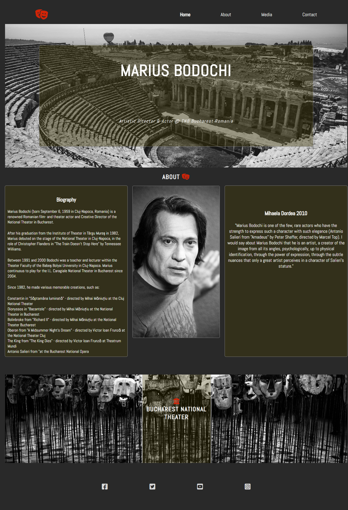
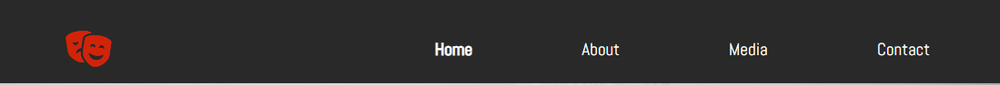
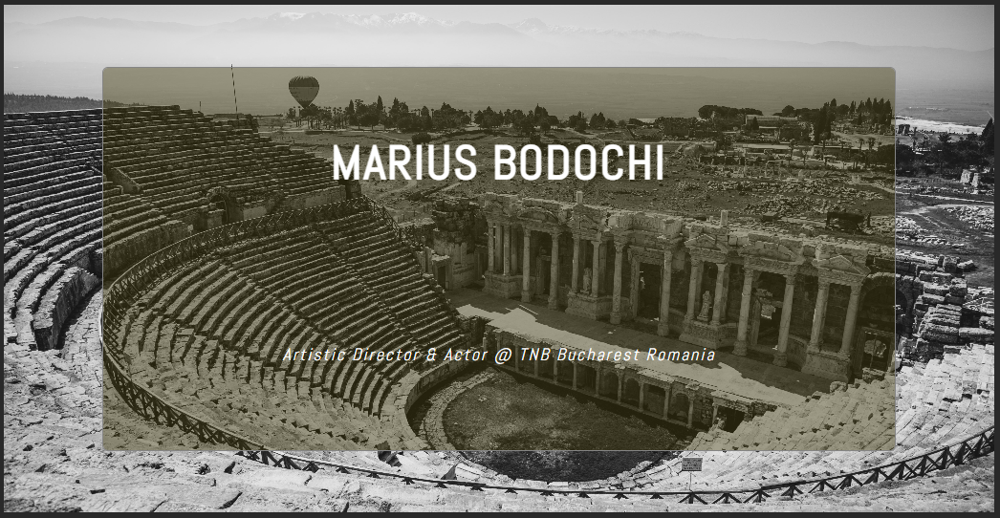
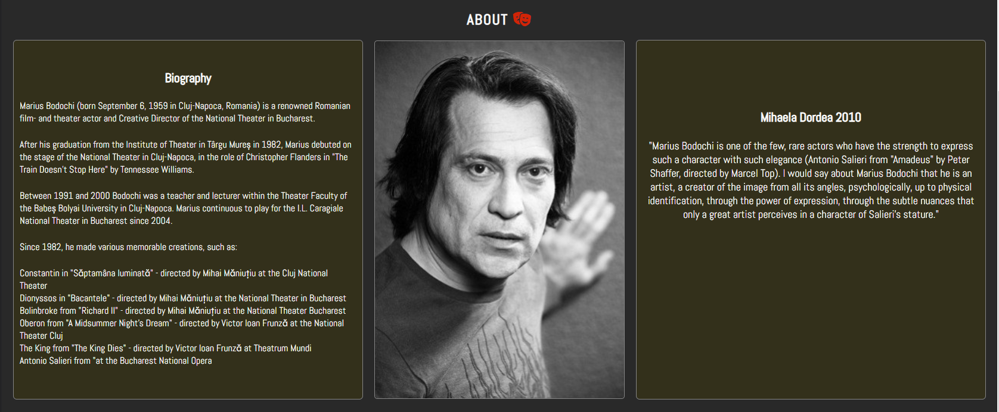
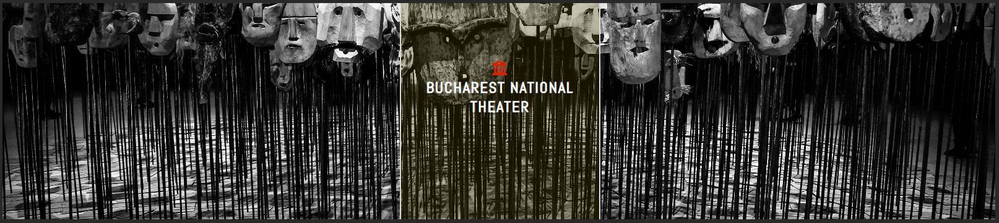
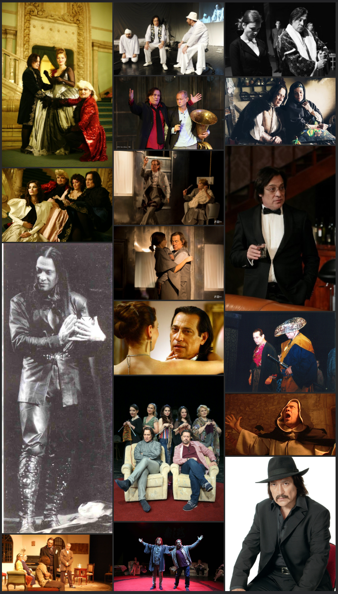
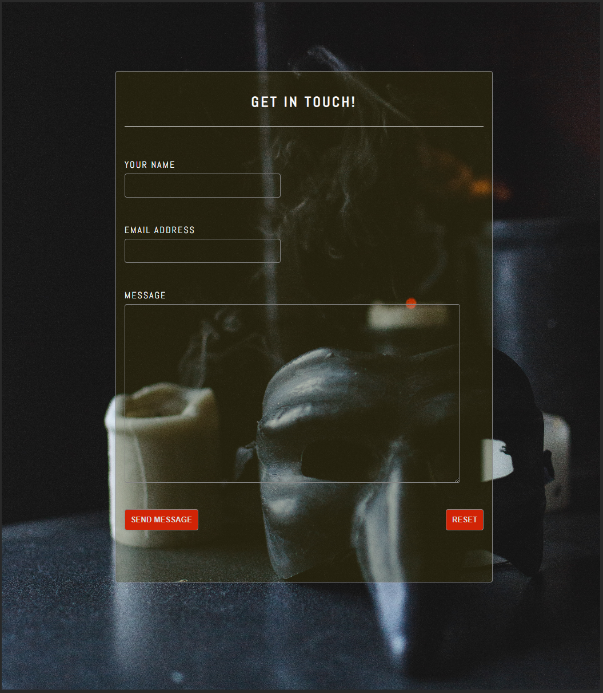
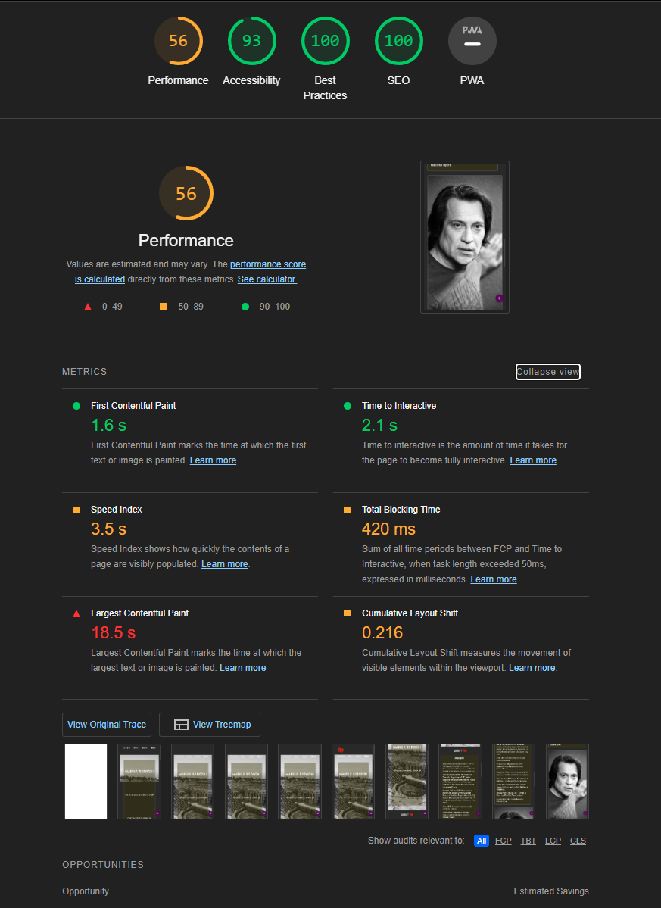

# Marius Bodochi 
- __Actor and Artistic Director at TNB Bucharest__

This site is meant to serve as a platform for the ones that love the Dramatic Art and want to understand more about the presented actor and get in touch with him.

The goal of this platform is to briefly introduce the fan to the work of this artist 
and to facilitate the option of further discovering the work of Marius Bodochi through the use of social media and the Bucharest National Theater website! 

## Features

- As briefly described above the purpose of this website is to serve as a quick introduction for the Artist, but also to facilitate the conection between the Dramatic Art enthusiasts and the actor.
- Besides the immediate features this website also presents itself as a quick and easy to use platfom that enables not only the fans, 
but any curios minds to keep track of the artist, his latest works, any public apparitions and of course all possible future projects!
- The brief introduction is made through the Home Page in the About section, which is also accompanied by a visual variety that opens a photo gallery with the use of Media Tab in the Menu bar.
- At the bottom of the page, the user can find quick links to the artists Social Media accounts which will enable further research about the work of the artist. 
- As an extra styling feature the Mask Icon situated at the left of the Menu will change the color from red to gold when hovered over. 
- This styling feature is also repeated throughout the page when using the mask icon on the About section and also when using the institution icon for the TNB section above the footer at the bottom of Home page.

### Build Features

- __Navigation__ 

- On all three pages at the top, the user can find the Navigation bar which will facilitate access to the Home page (with the "About" Section included), the Media and the Contact page.
- On the left side of the Navigation bar, there's also included an icon, that has the same functionality as the Home page button. 
- This Theater Mask symbol also serves as an estetic element which is supposed to be well integrated in the design of the website.  
- The Navigation bar is also fully responsive and will adapt according to the screen size.

- __Home page top__

- Below the Nav bar, at the top of the Home page, the user can find an antic roman theatre image,
that is overlayed with the Artist name and a quick introduction to his career title & the institution he's currently hired with.
- The color combination and the black and white picture are supposed to introduce the user to the Artist and that has a long fruitful career in the Dramatic Art.
- This combination, while introdcing the Actor it also sets the stage for the next section in a catchy and nostalgic way that transposes the user in the fascinating world of thatre and film!   

- __About Section__

- The About section is segmented in three parts, from left to right. 
- The first section on the left presents a brief introduction about the artists career and his biography.
- The middle section is features an expressive portrait picture of the Artist which is also in black and white, in order to fit the styling and the feel of the website.
- The third section or the section on the right side, presents a remarkable quote about the artist written by the prolific writer and arts critic from Romania, Mihaela Dordea.
- As an important note for the About section, since is situated on the Home Page (below the introduction image), the user is presented with a handy feature that allows the page to scroll back to the top simply by clicking the stylish theater mask icon situated to the right of the About title.

- __National Bucharest Theater Section__

- This section is minimal in design and besides the esthetical aspect it's also meant to serve the purpose of redirecting the user to the Actor profile over to the Bucharest National Theatre website. 
- This functionality is met by clicking on the red institution icon situated above the "BUCHAREST NATIONAL THEATRE" title. 

- __Footer Section__

- This section provides links to the Social Media accounts that feature the Artist and his work. 
- By accessing these links the user can research the past work of the Actor and stay updated with regards to the current and future projects that the Artist is working on.
- All links are set to open in a new browser tab in order to ease the user navigation. 
- The footer section is of course present at the bottom of all three pages that are accessible through the Navigation bar. 

- __Media Tab__

- This tab is supposed to provide a collage of images that represent the highlights of the Artists career on stage or on film sets
- The expressive gestures, poses and attitudes manifested by the actor through the intepreted roles in these picures should provide a clear representation of the artists abilities and acting! 

- __Contact Tab__ 

- The Contact tab serves as a direct communication tool that will inable the user to get in touch with the Artist for any queries and remarks.
- This page should also serves as a useful tool for any booking agency or project representatives that would like to send a proposal to the Artist.
- The form presented on this page requires the user to input the their name and contact email before typing in the desired message.
- At the bottom of the form there are two stylized inputs, one for submitting the message and the other one for reseting the form. 
- Both buttons are stylized in the same manner as the Mask Icon in the Navigation bar.

### Followup Features

- Another useful functionality that could be implemented in this project would be a Calendar Tab that would provide the user with a clear overview of the Artist schedule,
where already booked and free dates are highlighted in a distinct way.

## Testing 

- The functionality and scaling testing was done extensively through the inspector toll on the Google Chrome browser but also on iPhone 13 & iPhone 13 Pro devices.
- So far it was concluded that the scaling works perfectly well down to iPhone 13 Pro or 390 / 844px, with some of the elemts that are not perfectly centered when scaling down to 320 / 1415px. 
- However all functionalities are working correctly, are perfectly accessible and visible even when scaling down to 320 / 1415px.
- Extra testing was performed for the overall score of the website on different levels through the use of Lighthouse found inside the inspector tools in Google Chrome.
- The results were as follows:

### Validator Tests

- For the HTML files (index.html, media.html & contact.html):
  - No errors were returned when passing through the official [W3C validator](https://validator.w3.org/nu/?doc=https%3A%2F%2Fcode-institute-org.github.io%2Flove-running-2.0%2Findex.html)

- For the style.css file: 
  - No errors were found when passing through the official [(Jigsaw) validator](https://jigsaw.w3.org/css-validator/validator?uri=https%3A%2F%2Fvalidator.w3.org%2Fnu%2F%3Fdoc%3Dhttps%253A%252F%252Fcode-institute-org.github.io%252Flove-running-2.0%252Findex.html&profile=css3svg&usermedium=all&warning=1&vextwarning=&lang=en#css)

### Unfixed Issues

- 

## Deployment

- The website was deployed to GitHub pages by taking the following steps: 
  - In the GitHub repository, navigate to the Settings tab (top left menu, the last tab to the right) 
  - From the side menu, under **General** select _Pages_  
  - On the front page that opened, under **Branch**, from the dropdown menu under _none_ sellect _main_ and click on the _Save_ button
  - Once the main branch has been selected, the page can be refreshed and on top (under **GitHub Pages**) the _https://_ address where the site has been deployed will be displayed, indicating the successful deployment.

## Credits 

- ### Code
    - Mainly the lessons and modules specifically the Coders Coffeehouse project and Love Running were used as a support in the creation of this Artist website.
    - Also there was partly reliance on the [W3schools](https://www.w3schools.com/default.asp) website when checking different HTML or CSS styling coding procedures.
    - More precisely for the Flexbox features the following page was used as inspiration [Flexbox](https://www.w3schools.com/css/css3_flexbox.asp)
    - The Footer **HTML** code that includes the Social Media links was copied from the _Love Running_ project, however some the used icons were replaced with different ones that better fit the style of this website!

- ### Content
    - The biography & introduction text used on the left side of the About section was taken from the [Wikipedia](https://ro.wikipedia.org/wiki/Marius_Bodochi) article that presents the Actor. 
    - The quote written by the writer and art critic Mihaela Dordea on 28th of May 2010 was taken from an article that was presenting the role of Marius Bodochi in the Amadeus play [Curentul-International](http://curentul.net/2010/05/28/regal-marius-bodochi-la-opera-nationala-amadeus/).

- ### Media
    - The Background images for the Home page and the Contact form were taken from the official free to use stock photos website [Pexels](https://www.pexels.com/)
    - The icons used in the Menu bar and on the Home page were obtained from the free stock ofered by [Fontawesome](https://fontawesome.com/search?o=r&m=free)
    - Most of the photos included in the Media and Home tab were provided by the artist but also another batch were taken from the artist profile on National Bucharest Theatre [TNB](https://www.tnb.ro/ro/marius-bodochi) and from Google images search. 
